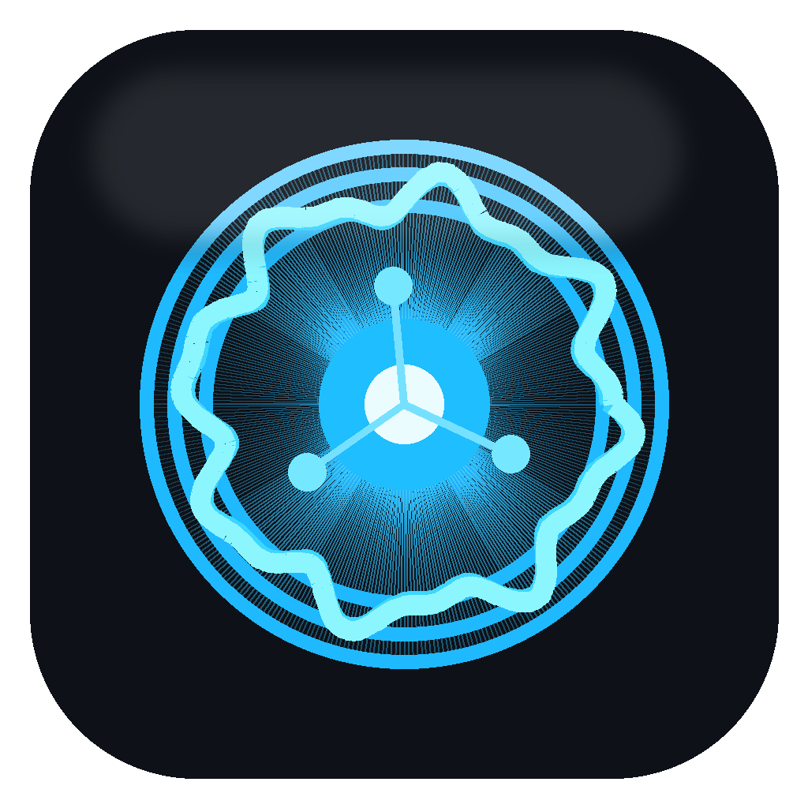

# Agent Voice Bar

> Beta local voice inbox for AI agents. Think "reverse Spokenly": agents talk
> back to you through local TTS, notifications, and a replayable macOS inbox.

Agent Voice Bar is a local-first macOS app for speech messages from AI agents.
Codex, Claude Code, or any MCP-capable tool can call a `speak_text` tool, and
your Mac turns that message into a local voice clip.

It is especially useful when agents run in another terminal, another app, or a
remote SSH box. With a reverse SSH tunnel, a cloud/Ubuntu agent can still send
voice updates to the Mac on your desk.



## Status

This is beta software. The core loop works, but the app is still being polished:

- local Qwen/MLX TTS backend
- MCP `speak_text` tool
- notify/autoplay/silent modes
- replayable scrolling inbox
- macOS notification fallback through `terminal-notifier`
- optional remote use over reverse SSH

## Why

Spokenly is great for speech-to-text: you talk, agents receive text.

Agent Voice Bar is the other direction: agents talk, you receive local speech.

Use it for:

- long-running agent status updates
- remote Codex or Claude Code sessions
- background coding/research agents
- "tell me when you need me" workflows
- local-only TTS without cloud accounts

## Architecture

```text
AI agent
  |
  | MCP speak_text
  v
Qwen speech backend on Mac
  |
  | queue.jsonl + generated wav files
  v
Agent Voice Bar macOS app
  |
  | notify / autoplay / silent
  v
Your ears + replayable inbox
```

Remote flow:

```text
Remote Codex/Claude
  |
  | MCP stdio bridge
  v
127.0.0.1:51090 on remote
  |
  | reverse SSH tunnel
  v
127.0.0.1:51090 on Mac
  |
  v
Local Qwen speech backend
```

## Requirements

- macOS 14+
- Apple Silicon recommended
- Xcode Command Line Tools for `swiftc`
- Homebrew
- Python 3
- `mlx-audio` for the bundled Qwen backend
- optional but recommended: `terminal-notifier`

The default beta backend uses:

```text
mlx-community/Qwen3-TTS-12Hz-1.7B-Base-8bit
```

Default voice:

```text
Chelsie
```

## Quick Start

Build and install the app:

```bash
./scripts/install-local.sh
```

Install the local Qwen/MLX backend:

```bash
./scripts/setup-qwen-backend.sh
```

Check the local runtime:

```bash
./scripts/check-local-models.sh
```

Install the notification fallback:

```bash
brew install terminal-notifier
```

## MCP Setup

Local Codex:

```bash
codex mcp add qwen_speech -- "$HOME/Library/Application Support/AgentVoiceBar/qwen-speech-mcp.sh"
```

Local Claude Code:

```bash
claude mcp add qwen_speech -- "$HOME/Library/Application Support/AgentVoiceBar/qwen-speech-mcp.sh"
```

Then ask your agent to call `qwen_speech.speak_text`.

Full local/remote instructions are in [docs/mcp-and-ssh.md](docs/mcp-and-ssh.md).

## App Modes

- `Auto`: generate and play messages immediately.
- `Notify`: generate messages, notify you, and keep them in the inbox.
- `Silent`: generate and keep messages without popping up or playing.

Every message is stored locally in:

```text
~/Library/Application Support/AgentVoiceBar/
```

Important files:

- `config.json`: mode, voice, speed, generation settings
- `pronunciations.json`: custom pronunciation replacements
- `queue.jsonl`: inbox history
- `state.json`: latest item and app state
- `out/`: generated WAV files

## Local Models

The beta ships with a Qwen/MLX backend because it sounds decent locally on a
capable Mac and exposes a simple MCP tool.

The backend is intentionally replaceable. Future versions should support a model
picker for engines such as Qwen, Kokoro, Chatterbox, and other local TTS models.

Run:

```bash
./scripts/check-local-models.sh
```

to verify Swift, Homebrew, terminal-notifier, the backend venv, `mlx-audio`, and
the local MCP HTTP bridge.

## Reverse SSH

Agent Voice Bar works well with remote agents if you expose your Mac's local
speech backend to the remote host through a reverse tunnel:

```bash
ssh -N -T \
  -o ExitOnForwardFailure=yes \
  -o ServerAliveInterval=30 \
  -o ServerAliveCountMax=3 \
  -R 127.0.0.1:51090:127.0.0.1:51090 \
  user@your-remote-host
```

See [docs/mcp-and-ssh.md](docs/mcp-and-ssh.md) for the remote bridge setup.

## Build

```bash
./scripts/build-app.sh
```

The built app is written to:

```text
build/Agent Voice Bar.app
```

## Login Item

To start the app at login, adapt:

```text
examples/launch-agent.example.plist
```

Then copy it into:

```text
~/Library/LaunchAgents/
```

## Security And Privacy

- No hosted service is required.
- Messages and WAV files stay on your Mac by default.
- Remote use should be done through your own SSH tunnel.
- Do not commit your own LaunchAgents, hostnames, queue files, generated audio,
  or private MCP config.

## Roadmap

See [docs/roadmap.md](docs/roadmap.md).

High-level direction:

- polished menu bar utility
- full dashboard app
- local model picker
- richer inbox/history
- per-agent voices and notification rules
- easier SSH/MCP setup

## License

MIT
